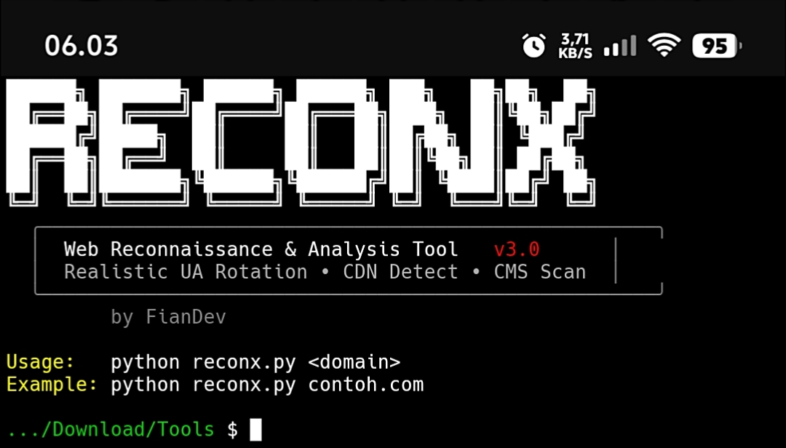

<!--
 ╔═══════════════════════════════════════════════════════════════╗
 ║  🛰️  ReconX v1 — Web Reconnaissance & Analysis Tool         ║
 ║  Author: FianDev                                            ║
 ║  Version: 1.0.0                                             ║
 ╚═══════════════════════════════════════════════════════════════╝
-->

<h1 align="center">
  
</h1>

<p align="center">
  
</p>

<p align="center">
  
  
  
  
</p>

---

## ⚠️ PERINGATAN — BACA DULU

> **<span style="color:red">‼️ IMPORTANT</span>**
>
> Tools ini dibuat untuk **educational & authorized security testing purposes ONLY**.
> Penggunaan untuk aktivitas ilegal, scanning tanpa izin, atau serangan terhadap infrastruktur yang bukan milik Anda adalah **tanggung jawab penuh pengguna**.
> **Penulis (FianDev) tidak bertanggung jawab atas penyalahgunaan tools ini.**
> Gunakan hanya pada domain/sistem yang Anda miliki atau dengan izin tertulis dari pemilik.

---

## 📌 TENTANG TOOLS

**ReconX v1** adalah tools otomatis untuk *web reconnaissance* dan *security analysis* yang menggabungkan DNS resolver, CDN detection, CMS fingerprinting, security header audit, dan port scanning dalam satu perintah. Cocok untuk:

- ✅ **Bug Bounty Recon** — mengumpulkan informasi awal target
- ✅ **Security Audit** — mengaudit konfigurasi header keamanan
- ✅ **Infrastructure Mapping** — memetakan CDN, origin, dan subdomain
- ✅ **OSINT Research** — mengumpulkan intelijen IP, ASN, dan organisasi
- ✅ **Educational Purpose** — belajar cara kerja HTTP, DNS, TLS, dan CDN

### 🎯 FITUR LENGKAP

| No | Fitur | Deskripsi |
|----|-------|-----------|
| 1 | **Auto DNS Resolve** | Resolve domain ke semua IP A record (multi-IP support) |
| 2 | **CDN Detection** | Deteksi 5 provider CDN: AWS CloudFront, Cloudflare, Akamai, Fastly, Google Cloud |
| 3 | **Multi-CDN Layer** | Deteksi layering CDN (misal: CloudFront edge + Cloudflare WAF) |
| 4 | **IP Intelligence** | Ambil ASN, Org, dan Country via ip-api.com |
| 5 | **Subdomain Enumeration** | Scan 23 subdomain umum dengan multi-threading |
| 6 | **Port Scanner** | Scan 7 port umum (21, 22, 25, 80, 443, 8080, 8443) |
| 7 | **CMS Detection** | Fingerprint 7 CMS: WordPress, Drupal, Joomla, Shopify, Magento, Wix, Squarespace |
| 8 | **Security Header Audit** | Cek 13 security header penting (CSP, HSTS, X-Frame, dll) |
| 9 | **WAF Detection** | Deteksi Cloudflare WAF via `Server` & `CF-Ray` header |
| 10 | **UA Rotation** | Rotasi 40+ realistic User-Agent (Chrome, Firefox, Safari, Edge, Mobile, Bot) |
| 11 | **Browser Header Emulation** | Auto-generate `sec-ch-ua-*` sesuai UA (Chromium client hints) |
| 12 | **Risk Scoring** | Skor risiko 0–100 dengan kategori INFORMATIONAL → HIGH |
| 13 | **Auto Clear Screen** | Bersihkan terminal tiap scan (Windows/Linux/Mac) |
| 14 | **ASCII Banner** | Banner gradien warna khas hacker-style |
| 15 | **Colorful UI** | Output warna rapi dengan border dan ikon unicode |
| 16 | **Smart Retry** | Retry otomatis untuk status 429, 500, 502, 503, 504 |

---

## 🔧 INSTALLASI LENGKAP

### 📋 Prasyarat

| Komponen | Minimal |
|----------|---------|
| Python | 3.8+ |
| Pip | latest |
| Git | latest |

### 📦 Dependencies

| Package | Fungsi |
|---------|--------|
| `requests` | HTTP client + session + retry adapter |
| `urllib3` | Retry & warning suppression |

*(Semua library lain adalah **built-in Python**: `socket`, `ssl`, `json`, `re`, `random`, `time`, `ipaddress`, `concurrent.futures`, `datetime`)*

### 🚀 Step-by-Step

#### 1. Langkah instalasi 🛠️

```bash
# Clone repository
git clone https://github.com/FianXploit/ReconxV1
cd ReconxV1

# Install dependencies
pip install requests urllib3

# Jalankan tools
python reconx.py <domain>